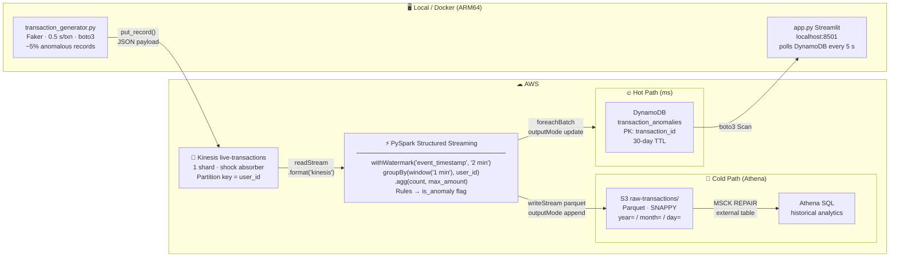
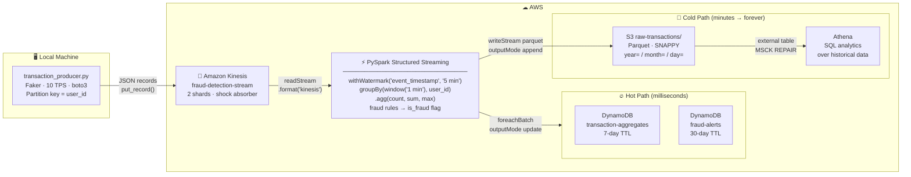

# Real-Time Transaction Anomaly Detection Engine

A production-grade streaming data pipeline that detects anomalous financial transactions **in real time** using AWS Kinesis, PySpark Structured Streaming, DynamoDB, S3/Athena, and a live Streamlit dashboard.

Built to demonstrate the streaming engineering concepts seen in senior Data Engineering interviews: **checkpointing**, **tumbling windows**, and **event-time watermarking**.

---

## Architecture



---

## JSON Payload (transaction_generator.py → Kinesis)

```json
{
  "transaction_id": "3f2a1b4c-...",
  "user_id":        "user_042",
  "amount":         2847.63,
  "merchant":       "Best Buy",
  "timestamp":      "2026-05-28T12:00:00.123456+00:00"
}
```

---

## Project Structure

```
.
├── transaction_generator.py      # Phase 1 — Mock POS, pushes JSON to Kinesis
├── app.py                        # Phase 5 — Streamlit live dashboard
│
├── spark_streaming/
│   ├── schemas.py                # PySpark StructType matching the JSON payload
│   └── fraud_detection_job.py   # Phase 3 & 4 — Core PySpark Streaming job
│
├── infrastructure/
│   └── setup_aws.py              # Phase 2 — One-time AWS resource provisioner
│
├── config/
│   └── settings.py               # All config loaded from env vars / .env
│
├── Dockerfile.generator          # Docker image for the generator (ARM64)
├── Dockerfile.spark              # Docker image for the Spark job (ARM64)
├── Dockerfile.dashboard          # Docker image for Streamlit (ARM64)
├── docker-compose.yml            # Orchestrates all three services locally
│
├── .env.example                  # Environment variable template
├── requirements.txt
├── run_producer.sh               # run_generator.sh wrapper
├── run_spark_job.sh              # spark-submit with --packages
└── athena_setup.sql              # Generated by setup_aws.py; run in Athena
```

---

## Prerequisites

| Tool | Version | Notes |
|---|---|---|
| Python | ≥ 3.9 | `python --version` |
| Java | 11 or 17 | Required by Spark — `java -version` |
| Apache Spark | 3.5.x | `spark-submit` must be on `$PATH` |
| AWS CLI | v2 | `aws configure` to set credentials |
| Docker Desktop | latest | For containerised local dev |

---

## Quick Start (local, no Docker)

### 1  Install Python dependencies
```bash
pip install -r requirements.txt
```

### 2  Configure credentials
```bash
cp .env.example .env
# Edit .env:
#   AWS_REGION, AWS_ACCESS_KEY_ID, AWS_SECRET_ACCESS_KEY
#   S3_BUCKET (must be globally unique — add your name as a suffix)
```

### 3  Provision AWS resources  *(one-time)*
```bash
python infrastructure/setup_aws.py
```
Creates the Kinesis stream (`live-transactions`), DynamoDB table (`transaction_anomalies`), and S3 bucket.

### 4  Terminal 1 — Start the transaction generator
```bash
bash run_producer.sh
# or: python transaction_generator.py
```
Sample output:
```
[NORMAL]   id=3f2a1b4c-...  user=user_042  amount=$   34.21  merchant=Starbucks       shard=shardId-000000000000
[ANOMALY]  id=a9c3e7f1-...  user=user_018  amount=$3847.63  merchant=Best Buy         shard=shardId-000000000000
```

### 5  Terminal 2 — Start the PySpark Streaming job
```bash
bash run_spark_job.sh
```

### 6  Terminal 3 — Launch the Streamlit dashboard
```bash
streamlit run app.py
# Open http://localhost:8501
```

---

## Quick Start (Docker — recommended for M1/M2/M3 Mac)

```bash
cp .env.example .env   # fill in your values

# Build all three images (ARM64-native)
docker compose build

# Start everything
docker compose up

# Dashboard is at http://localhost:8501
```

---

## Key Engineering Concepts

### 1  Checkpointing

**Problem:** If the Spark job crashes mid-stream, how do we avoid re-processing records or losing aggregation state?

**Solution:** Before committing each micro-batch, Spark atomically writes to the checkpoint directory:
1. **Offsets** — the Kinesis sequence number of the last record consumed from each shard.
2. **State store** — the partial sums inside any open windows.

On restart, Spark reads both files and resumes from the exact committed position.

```python
hot_path_query = (
    windowed_anomalies
    .writeStream
    .foreachBatch(write_anomalies_to_dynamodb)
    .option(
        "checkpointLocation",
        "/tmp/live-transactions-checkpoint/dynamodb-hot-path",  # unique per query
    )
    .start()
)
```

> **Try it:** Run the job for 30 s → kill it (Ctrl-C) → inspect
> `/tmp/live-transactions-checkpoint/dynamodb-hot-path/offsets/` →
> restart; it resumes from the saved sequence numbers.

---

### 2  Tumbling Windows

**What they are:** Fixed, non-overlapping 1-minute time buckets. Every event lands in exactly one bucket.

```
Event time:  12:00          12:01          12:02
               ├── Window 1 ──┼── Window 2 ──┼── Window 3 ──
                  txn_A txn_B     txn_C          txn_D
```

Events are bucketed by `event_timestamp` (the time the transaction *happened*), not processing time.

```python
.groupBy(
    window(col("event_timestamp"), "1 minute"),   # 1-min tumbling window
    col("user_id"),
)
.agg(
    count("*").alias("transaction_count"),
    _max("amount").alias("max_amount"),
)
```

**Anomaly rules per window:**

| Rule | Condition | Flag |
|---|---|---|
| Large transaction | `max_amount > $2,000` | `HIGH_AMOUNT` |
| Velocity abuse | `transaction_count > 3` | `HIGH_FREQUENCY` |

---

### 3  Watermarking

**Problem:** A transaction timestamped at 12:00:00 may reach Kinesis at 12:01:45 (network lag). Without watermarking, Spark must keep every window open forever.

**Solution:** `.withWatermark("event_timestamp", "2 minutes")` — accept events up to 2 minutes late; seal and discard state after.

```python
.withWatermark("event_timestamp", "2 minutes")
```

```
Processing time = 12:05
Watermark       = 12:05 − 2 min = 12:03

  Window [12:00–12:01]: SEALED  ← state freed, final results emitted
  Window [12:03–12:04]: OPEN    ← still accumulating
```

---

## DynamoDB Schema — `transaction_anomalies`

| Attribute | Type | Notes |
|---|---|---|
| `transaction_id` **(PK)** | String | `{user_id}#{window_start}` — idempotent upsert |
| `user_id` | String | |
| `window_start` / `window_end` | String | ISO-8601 UTC |
| `transaction_count` | Number | Transactions in this window |
| `max_amount` | Number | Decimal (2 d.p.) |
| `anomaly_flags` | List | `HIGH_AMOUNT`, `HIGH_FREQUENCY` |
| `is_anomaly` | Boolean | Always `true` (only flagged rows are written) |
| `detected_at` | String | ISO-8601 timestamp of detection |
| `ttl` | Number | Unix epoch; DynamoDB auto-deletes after **30 days** |

---

## Athena Cold-Path Analytics

After `setup_aws.py` runs, open `athena_setup.sql` in the Athena Query Editor:

```sql
-- Transactions above the $2,000 threshold this month
SELECT user_id, amount, merchant, event_timestamp
FROM transaction_analytics.transactions
WHERE amount > 2000.0
  AND year = YEAR(CURRENT_DATE) AND month = MONTH(CURRENT_DATE)
ORDER BY amount DESC LIMIT 50;
```

---

## Required IAM Permissions

```json
{
  "Version": "2012-10-17",
  "Statement": [
    {
      "Effect": "Allow",
      "Action": ["kinesis:CreateStream", "kinesis:DescribeStream",
                 "kinesis:DescribeStreamSummary", "kinesis:GetShardIterator",
                 "kinesis:GetRecords", "kinesis:PutRecord"],
      "Resource": "*"
    },
    {
      "Effect": "Allow",
      "Action": ["dynamodb:CreateTable", "dynamodb:DescribeTable",
                 "dynamodb:UpdateTimeToLive", "dynamodb:PutItem",
                 "dynamodb:BatchWriteItem", "dynamodb:Scan", "dynamodb:Query"],
      "Resource": "*"
    },
    {
      "Effect": "Allow",
      "Action": ["s3:*"],
      "Resource": ["arn:aws:s3:::YOUR_BUCKET", "arn:aws:s3:::YOUR_BUCKET/*"]
    },
    {"Effect": "Allow", "Action": ["athena:*", "glue:*"], "Resource": "*"}
  ]
}
```

---

## Cost Estimate (2 TPS, 24 h — AWS Free Tier friendly)

| Service | Usage | Approx. Cost |
|---|---|---|
| Kinesis | 1 shard × 24 h | ~$0.015 |
| DynamoDB | ~170,000 writes (on-demand) | ~$0.20 |
| S3 | ~10 MB Parquet | < $0.01 |
| Athena | per TB scanned | < $0.01 |
| **Total** | | **~$0.25 / day** |

---

## Cleanup

```bash
aws kinesis delete-stream --stream-name live-transactions
aws dynamodb delete-table --table-name transaction_anomalies
aws s3 rm s3://YOUR_BUCKET_NAME --recursive
aws s3api delete-bucket --bucket YOUR_BUCKET_NAME
rm -rf /tmp/live-transactions-checkpoint
```

---

## Future Improvements

- **ML scoring** — replace threshold rules with a pre-trained Isolation Forest or AutoEncoder, served via SageMaker.
- **Infrastructure as Code** — Terraform scripts to provision Kinesis, DynamoDB, and S3.
- **Data quality checks** — drop/quarantine malformed JSON in PySpark before aggregation.
- **SNS/SQS alerting** — publish DynamoDB Streams events to SNS → email/Slack on new anomalies.
- **Sliding windows** — add overlapping 5-minute windows for higher recall on distributed burst attacks.


A production-grade streaming data pipeline that detects financial fraud **in milliseconds** using AWS Kinesis, PySpark Structured Streaming, DynamoDB, and S3/Athena.

Built to demonstrate the three core streaming engineering concepts that appear on every senior data engineering job description: **checkpointing**, **tumbling windows**, and **event-time watermarking**.

---

## Architecture



---

## Project Structure

```
.
├── config/
│   └── settings.py                  # Env-var-driven config for all modules
├── producer/
│   └── transaction_producer.py      # Mock POS — generates & pushes to Kinesis
├── spark_streaming/
│   ├── schemas.py                   # PySpark StructType for incoming JSON
│   └── fraud_detection_job.py       # ⭐ Main PySpark Structured Streaming job
├── infrastructure/
│   └── setup_aws.py                 # One-time AWS resource provisioning script
├── .env.example                     # Environment variable template
├── requirements.txt
├── run_producer.sh                  # Convenience wrapper for the producer
├── run_spark_job.sh                 # spark-submit with all required --packages
└── athena_setup.sql                 # Generated by setup_aws.py; run in Athena
```

---

## Prerequisites

| Tool | Version | Install |
|---|---|---|
| Python | ≥ 3.9 | `python --version` |
| Java | 11 or 17 | `java -version` |
| Apache Spark | 3.5.x | [spark.apache.org](https://spark.apache.org/downloads.html) — `spark-submit` must be on `$PATH` |
| AWS CLI | v2 | `aws --version` then `aws configure` |

---

## Quick Start

### 1  Clone & install Python dependencies
```bash
pip install -r requirements.txt
```

### 2  Configure environment
```bash
cp .env.example .env
# Open .env and fill in:
#   AWS_REGION, S3_BUCKET (must be globally unique), and optionally thresholds
```

### 3  Provision AWS resources  *(run once)*
```bash
python infrastructure/setup_aws.py
```
This creates the Kinesis stream, two DynamoDB tables, the S3 bucket with lifecycle rules, and writes `athena_setup.sql`.

### 4  Start the transaction producer  *(Terminal 1)*
```bash
bash run_producer.sh
```
You will see output like:
```
[INFO]  Producer starting — stream=fraud-detection-stream  rate=10 TPS  anomaly_rate=5.0%
[WARNING] [ANOMALY] HIGH_AMOUNT  user=user_0042  amount=$3847.12  shard=shardId-000000000001
[INFO]  Sent 100 transactions  (4 anomalies, 4.0%)
```

### 5  Submit the Spark job  *(Terminal 2)*
```bash
bash run_spark_job.sh
```
First run downloads Maven JARs (~2 min). On restart, the cached checkpoint is used automatically.

---

## Key Engineering Concepts

### 1  Checkpointing

**What it solves:** If the Spark job crashes, how do we avoid re-processing millions of records or losing in-flight window state?

**How it works:** Before each micro-batch is committed, Spark atomically writes two things to the checkpoint directory:
1. **Offsets file** — the Kinesis sequence number of the last record read from each shard.
2. **State store** — the partial aggregation results (running counts, sums) for any windows that are still open.

On restart, Spark reads these files and resumes from the exact committed position.

```python
# Each query gets its OWN checkpoint path.
# Two queries sharing a path would corrupt each other's state.
hot_path_query = (
    windowed_agg
    .writeStream
    .foreachBatch(write_to_hot_path)
    .option(
        "checkpointLocation",
        f"{CHECKPOINT_LOCATION}/dynamodb-hot-path",   # ← unique per query
    )
    .start()
)
```

> **Try it:** Let the job run for 30 s, kill it with Ctrl-C, then inspect
> `$CHECKPOINT_LOCATION/dynamodb-hot-path/offsets/` — you'll see JSON files
> containing Kinesis sequence numbers. Restart the job and verify it resumes
> from those positions, not from `LATEST`.

---

### 2  Tumbling Windows

**What they are:** Fixed, non-overlapping time buckets. Every event falls into exactly one bucket.

```
Event time axis:

12:00          12:01          12:02          12:03
  |── Window 1 ─|── Window 2 ─|── Window 3 ─|
     txn_A txn_B     txn_C        txn_D txn_E
```

**Why use event time (not processing time)?** A transaction that happened at 12:00:45 but arrived at Spark at 12:01:10 should be counted in Window 1, not Window 2. Tumbling windows on `event_timestamp` guarantee this.

```python
windowed_agg = (
    raw_stream
    .withWatermark("event_timestamp", "5 minutes")
    .groupBy(
        window(col("event_timestamp"), "1 minute"),  # ← 1-min tumbling window
        col("user_id"),
    )
    .agg(
        count("*").alias("transaction_count"),
        _sum("amount").alias("total_amount"),
        _max("amount").alias("max_amount"),
    )
)
```

**Fraud rules applied to each window:**

| Rule | Condition | Flag |
|---|---|---|
| Large transaction | `max_amount > $1,000` | `HIGH_SINGLE_TRANSACTION` |
| Velocity abuse | `transaction_count > 5` | `HIGH_FREQUENCY` |
| High total spend | `total_amount > $3,000` | `HIGH_TOTAL_SPEND` |

---

### 3  Watermarking

**What it solves:** Real networks introduce lag. A transaction timestamped at 12:00:00 may reach Kinesis at 12:04:45. Without watermarking, Spark must keep every window open forever (unbounded state). Without any tolerance, late events are simply dropped.

**Watermarking is the middle ground:**
> *"I will accept events arriving up to 5 minutes after their event_timestamp.  
> After that, I will seal the window and discard its state."*

```python
.withWatermark("event_timestamp", "5 minutes")
#                      ↑                ↑
#               event-time column    max lateness
```

The producer's `generate_late_transaction()` function intentionally backdates 1–2 % of events by 3–7 minutes to exercise this logic. Those events are correctly binned into their original windows (not the current one), as long as they arrive within the 5-minute tolerance.

```
                           watermark threshold
                                    │
Event time: 12:00  12:01  12:02  12:03  12:04  12:05
                                         ↑
                              Processing time = 12:09
                              Watermark      = 12:09 − 5 min = 12:04

  Window [12:00–12:01]: SEALED  (event time < watermark)
  Window [12:04–12:05]: OPEN    (still accumulating)
```

---

## DynamoDB Schemas

### `fraud-alerts`

| Attribute | Type | Notes |
|---|---|---|
| `alert_id` **(PK)** | String | `{user_id}#{window_start}` — idempotent upsert key |
| `user_id` | String | |
| `window_start` / `window_end` | String | ISO-8601 |
| `transaction_count` | Number | |
| `total_amount` / `max_amount` | Number | Decimal (2 d.p.) |
| `fraud_flags` | List | `HIGH_SINGLE_TRANSACTION`, `HIGH_FREQUENCY`, `HIGH_TOTAL_SPEND` |
| `severity` | String | `HIGH` (≥2 flags) or `MEDIUM` (1 flag) |
| `status` | String | `NEW` — ready for downstream alerting |
| `ttl` | Number | Unix epoch; DynamoDB auto-deletes after **30 days** |

### `transaction-aggregates`

| Attribute | Type | Notes |
|---|---|---|
| `pk` **(PK)** | String | `user_id` — query all windows for a user |
| `sk` **(SK)** | String | `window_start` — sort by time |
| `transaction_count` | Number | |
| `total_amount` / `max_amount` / `min_amount` | Number | Decimal |
| `distinct_categories` | Number | Approximate (HyperLogLog) |
| `is_fraud` | Boolean | |
| `fraud_flags` | List | |
| `ttl` | Number | Auto-deletes after **7 days** |

---

## Athena Cold-Path Analytics

After running `setup_aws.py`, open `athena_setup.sql` in the Athena Query Editor and run it section by section to create the external table.  Then query historical data with standard SQL:

```sql
-- High-value transactions this month
SELECT user_id, amount, merchant_category, event_timestamp
FROM fraud_detection.transactions
WHERE amount > 1000.0
  AND year = YEAR(CURRENT_DATE)
  AND month = MONTH(CURRENT_DATE)
ORDER BY amount DESC
LIMIT 50;

-- Hourly fraud-pattern spike detection
SELECT
    DATE_TRUNC('hour', event_timestamp) AS hour_bucket,
    COUNT(*)                            AS txn_count,
    SUM(amount)                         AS total_amount
FROM fraud_detection.transactions
WHERE year = YEAR(CURRENT_DATE)
GROUP BY 1 ORDER BY 1;
```

Athena charges per TB scanned — the `year/month/day` partition scheme means queries with date filters scan only the relevant Parquet files.

---

## Required IAM Permissions

```json
{
  "Version": "2012-10-17",
  "Statement": [
    {
      "Sid": "Kinesis",
      "Effect": "Allow",
      "Action": [
        "kinesis:CreateStream", "kinesis:DescribeStream",
        "kinesis:DescribeStreamSummary", "kinesis:ListStreams",
        "kinesis:GetShardIterator", "kinesis:GetRecords",
        "kinesis:PutRecord", "kinesis:PutRecords"
      ],
      "Resource": "*"
    },
    {
      "Sid": "DynamoDB",
      "Effect": "Allow",
      "Action": [
        "dynamodb:CreateTable", "dynamodb:DescribeTable",
        "dynamodb:UpdateTimeToLive", "dynamodb:ListTables",
        "dynamodb:PutItem", "dynamodb:BatchWriteItem",
        "dynamodb:GetItem", "dynamodb:Query"
      ],
      "Resource": "*"
    },
    {
      "Sid": "S3",
      "Effect": "Allow",
      "Action": ["s3:*"],
      "Resource": [
        "arn:aws:s3:::YOUR_BUCKET_NAME",
        "arn:aws:s3:::YOUR_BUCKET_NAME/*"
      ]
    },
    {
      "Sid": "Athena",
      "Effect": "Allow",
      "Action": ["athena:*", "glue:*"],
      "Resource": "*"
    }
  ]
}
```

---

## Cost Estimate (10 TPS, 24 h)

| Service | Usage | Approx. Cost |
|---|---|---|
| Kinesis | 2 shards × 24 h | ~$0.03 |
| DynamoDB | ~860,000 writes (on-demand) | ~$1.00 |
| S3 | ~50 MB Parquet | < $0.01 |
| Athena | per query (TB scanned) | < $0.01 |
| **Total** | | **~$1.05 / day** |

---

## Cleanup

```bash
# Kinesis
aws kinesis delete-stream --stream-name fraud-detection-stream

# DynamoDB
aws dynamodb delete-table --table-name fraud-alerts
aws dynamodb delete-table --table-name transaction-aggregates

# S3 (empty bucket first)
aws s3 rm s3://YOUR_BUCKET_NAME --recursive
aws s3api delete-bucket --bucket YOUR_BUCKET_NAME

# Local checkpoint
rm -rf /tmp/fraud-detection-checkpoint
```

---

## Future Improvements

- **ML-based scoring** — replace rule-based thresholds with a trained anomaly detection model (Isolation Forest, AutoEncoder) served via SageMaker.
- **Sliding windows** — add overlapping 5-minute windows for higher recall on distributed burst attacks.
- **SNS/SQS alerting** — publish `fraud-alerts` DynamoDB Streams to SNS → notify a fraud analyst in real time.
- **Schema registry** — integrate AWS Glue Schema Registry to enforce and evolve the JSON schema without breaking consumers.
- **EMR / Glue** — move from local `--master local[*]` to a managed cluster for production throughput.
