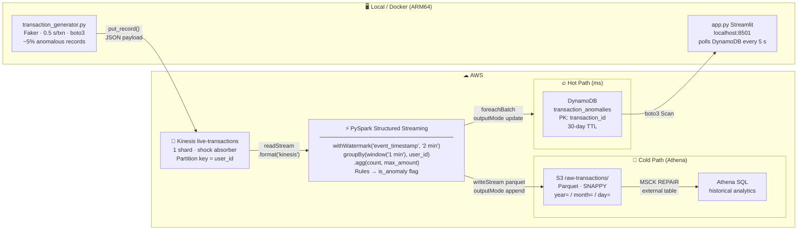

# Real-Time Transaction Anomaly Detection Engine


A production-grade streaming data pipeline that detects anomalous financial transactions **in real time** using AWS Kinesis, PySpark Structured Streaming, DynamoDB, S3/Athena, and a live Streamlit dashboard.

Built to demonstrate the streaming engineering concepts seen in senior Data Engineering interviews: **checkpointing**, **tumbling windows**, and **event-time watermarking**.

---

## Architecture



---

## JSON Payload (transaction_generator.py → Kinesis)

```json
{
  "transaction_id": "3f2a1b4c-...",
  "user_id":        "user_042",
  "amount":         2847.63,
  "merchant":       "Best Buy",
  "timestamp":      "2026-05-28T12:00:00.123456+00:00"
}
```

---

## Project Structure

```
.
├── transaction_generator.py      # Phase 1 — Mock POS, pushes JSON to Kinesis
├── app.py                        # Phase 5 — Streamlit live dashboard
│
├── spark_streaming/
│   ├── schemas.py                # PySpark StructType matching the JSON payload
│   └── fraud_detection_job.py   # Phase 3 & 4 — Core PySpark Streaming job
│
├── infrastructure/
│   └── setup_aws.py              # Phase 2 — One-time AWS resource provisioner
│
├── config/
│   └── settings.py               # All config loaded from env vars / .env
│
├── Dockerfile.generator          # Docker image for the generator (ARM64)
├── Dockerfile.spark              # Docker image for the Spark job (ARM64)
├── Dockerfile.dashboard          # Docker image for Streamlit (ARM64)
├── docker-compose.yml            # Orchestrates all three services locally
│
├── .env.example                  # Environment variable template
├── requirements.txt
├── run_generator.sh              # Convenience wrapper for transaction_generator.py
├── run_spark_job.sh              # spark-submit with --packages
└── athena_setup.sql              # Generated by setup_aws.py; run in Athena
```

---

## Prerequisites

| Tool | Version | Notes |
|---|---|---|
| Python | ≥ 3.9 | `python --version` |
| Java | 11 or 17 | Required by Spark — `java -version` |
| Apache Spark | 3.5.x | `spark-submit` must be on `$PATH` |
| AWS CLI | v2 | `aws configure` to set credentials |
| Docker Desktop | latest | For containerised local dev |

---

## Quick Start (local, no Docker)

### 1  Install Python dependencies
```bash
pip install -r requirements.txt
```

### 2  Configure credentials
```bash
cp .env.example .env
# Edit .env:
#   AWS_REGION, AWS_ACCESS_KEY_ID, AWS_SECRET_ACCESS_KEY
#   S3_BUCKET (must be globally unique — add your name as a suffix)
```

### 3  Provision AWS resources  *(one-time)*
```bash
python infrastructure/setup_aws.py
```
Creates the Kinesis stream (`live-transactions`), DynamoDB table (`transaction_anomalies`), and S3 bucket.

### 4  Terminal 1 — Start the transaction generator
```bash
bash run_generator.sh
# or: python transaction_generator.py
```
Sample output:
```
[NORMAL]   id=3f2a1b4c-...  user=user_042  amount=$   34.21  merchant=Starbucks       shard=shardId-000000000000
[ANOMALY]  id=a9c3e7f1-...  user=user_018  amount=$3847.63  merchant=Best Buy         shard=shardId-000000000000
```

### 5  Terminal 2 — Start the PySpark Streaming job
```bash
bash run_spark_job.sh
```

### 6  Terminal 3 — Launch the Streamlit dashboard
```bash
streamlit run app.py
# Open http://localhost:8501
```

---

## Quick Start (Docker — recommended for M1/M2/M3 Mac)

```bash
cp .env.example .env   # fill in your values

# Build all three images (ARM64-native)
docker compose build

# Start everything
docker compose up

# Dashboard is at http://localhost:8501
```

---

## Key Engineering Concepts

### 1  Checkpointing

**Problem:** If the Spark job crashes mid-stream, how do we avoid re-processing records or losing aggregation state?

**Solution:** Before committing each micro-batch, Spark atomically writes to the checkpoint directory:
1. **Offsets** — the Kinesis sequence number of the last record consumed from each shard.
2. **State store** — the partial sums inside any open windows.

On restart, Spark reads both files and resumes from the exact committed position.

```python
hot_path_query = (
    windowed_anomalies
    .writeStream
    .foreachBatch(write_anomalies_to_dynamodb)
    .option(
        "checkpointLocation",
        "/tmp/live-transactions-checkpoint/dynamodb-hot-path",  # unique per query
    )
    .start()
)
```

> **Try it:** Run the job for 30 s → kill it (Ctrl-C) → inspect
> `/tmp/live-transactions-checkpoint/dynamodb-hot-path/offsets/` →
> restart; it resumes from the saved sequence numbers.

---

### 2  Tumbling Windows

**What they are:** Fixed, non-overlapping 1-minute time buckets. Every event lands in exactly one bucket.

```
Event time:  12:00          12:01          12:02
               ├── Window 1 ──┼── Window 2 ──┼── Window 3 ──
                  txn_A txn_B     txn_C          txn_D
```

Events are bucketed by `event_timestamp` (the time the transaction *happened*), not processing time.

```python
.groupBy(
    window(col("event_timestamp"), "1 minute"),   # 1-min tumbling window
    col("user_id"),
)
.agg(
    count("*").alias("transaction_count"),
    _max("amount").alias("max_amount"),
)
```

**Anomaly rules per window:**

| Rule | Condition | Flag |
|---|---|---|
| Large transaction | `max_amount > $2,000` | `HIGH_AMOUNT` |
| Velocity abuse | `transaction_count > 3` | `HIGH_FREQUENCY` |

---

### 3  Watermarking

**Problem:** A transaction timestamped at 12:00:00 may reach Kinesis at 12:01:45 (network lag). Without watermarking, Spark must keep every window open forever.

**Solution:** `.withWatermark("event_timestamp", "2 minutes")` — accept events up to 2 minutes late; seal and discard state after.

```python
.withWatermark("event_timestamp", "2 minutes")
```

```
Processing time = 12:05
Watermark       = 12:05 − 2 min = 12:03

  Window [12:00–12:01]: SEALED  ← state freed, final results emitted
  Window [12:03–12:04]: OPEN    ← still accumulating
```

---

## DynamoDB Schema — `transaction_anomalies`

| Attribute | Type | Notes |
|---|---|---|
| `transaction_id` **(PK)** | String | `{user_id}#{window_start}` — idempotent upsert |
| `user_id` | String | |
| `window_start` / `window_end` | String | ISO-8601 UTC |
| `transaction_count` | Number | Transactions in this window |
| `max_amount` | Number | Decimal (2 d.p.) |
| `anomaly_flags` | List | `HIGH_AMOUNT`, `HIGH_FREQUENCY` |
| `is_anomaly` | Boolean | Always `true` (only flagged rows are written) |
| `detected_at` | String | ISO-8601 timestamp of detection |
| `ttl` | Number | Unix epoch; DynamoDB auto-deletes after **30 days** |

---

## Athena Cold-Path Analytics

After `setup_aws.py` runs, open `athena_setup.sql` in the Athena Query Editor:

```sql
-- Transactions above the $2,000 threshold this month
SELECT user_id, amount, merchant, event_timestamp
FROM transaction_analytics.transactions
WHERE amount > 2000.0
  AND year = YEAR(CURRENT_DATE) AND month = MONTH(CURRENT_DATE)
ORDER BY amount DESC LIMIT 50;
```

---

## Required IAM Permissions

```json
{
  "Version": "2012-10-17",
  "Statement": [
    {
      "Effect": "Allow",
      "Action": ["kinesis:CreateStream", "kinesis:DescribeStream",
                 "kinesis:DescribeStreamSummary", "kinesis:GetShardIterator",
                 "kinesis:GetRecords", "kinesis:PutRecord"],
      "Resource": "*"
    },
    {
      "Effect": "Allow",
      "Action": ["dynamodb:CreateTable", "dynamodb:DescribeTable",
                 "dynamodb:UpdateTimeToLive", "dynamodb:PutItem",
                 "dynamodb:BatchWriteItem", "dynamodb:Scan", "dynamodb:Query"],
      "Resource": "*"
    },
    {
      "Effect": "Allow",
      "Action": ["s3:*"],
      "Resource": ["arn:aws:s3:::YOUR_BUCKET", "arn:aws:s3:::YOUR_BUCKET/*"]
    },
    {"Effect": "Allow", "Action": ["athena:*", "glue:*"], "Resource": "*"}
  ]
}
```

---

## Cost Estimate (2 TPS, 24 h — AWS Free Tier friendly)

| Service | Usage | Approx. Cost |
|---|---|---|
| Kinesis | 1 shard × 24 h | ~$0.015 |
| DynamoDB | ~170,000 writes (on-demand) | ~$0.20 |
| S3 | ~10 MB Parquet | < $0.01 |
| Athena | per TB scanned | < $0.01 |
| **Total** | | **~$0.25 / day** |

---

## Cleanup

```bash
aws kinesis delete-stream --stream-name live-transactions
aws dynamodb delete-table --table-name transaction_anomalies
aws s3 rm s3://YOUR_BUCKET_NAME --recursive
aws s3api delete-bucket --bucket YOUR_BUCKET_NAME
rm -rf /tmp/live-transactions-checkpoint
```

---

## How to Test the Project

### Step 1 — Smoke-test the generator locally (no AWS needed)

Verify the transaction builder functions without touching Kinesis:

```bash
pip install -r requirements.txt

python - <<'EOF'
from transaction_generator import generate_normal_transaction, generate_anomalous_transaction
import json
print("=== 3 normal transactions ===")
for _ in range(3):
    print(json.dumps(generate_normal_transaction(), indent=2))
print("\n=== 1 anomalous transaction (amount > $2000) ===")
print(json.dumps(generate_anomalous_transaction(), indent=2))
EOF
```

Expected: 3 transactions with `amount` < $500, 1 with `amount` > $2,000.

---

### Step 2 — Test AWS connectivity

```bash
# Verify credentials resolve correctly
aws sts get-caller-identity

# Provision all resources (idempotent — safe to re-run)
python infrastructure/setup_aws.py

# Confirm Kinesis stream is ACTIVE
aws kinesis describe-stream-summary --stream-name live-transactions

# Confirm DynamoDB table exists
aws dynamodb describe-table --table-name transaction_anomalies --query "Table.TableStatus"
```

---

### Step 3 — Full end-to-end test (3 terminals)

**Terminal 1 — Start the generator:**
```bash
bash run_generator.sh
```
Watch for `[ANOMALY]` lines — these are the records that will trigger DynamoDB writes.

**Terminal 2 — Start the PySpark job:**
```bash
bash run_spark_job.sh
```
First run downloads Maven JARs (~2 min). Subsequent runs start in seconds.
Look for log lines like `[Hot Path] Batch N — wrote M anomaly window(s) to DynamoDB.`

**Terminal 3 — Launch the dashboard:**
```bash
streamlit run app.py
# Open http://localhost:8501
```
Within ~30 seconds of the first anomaly, you should see it appear in the live table.

---

### Step 4 — Verify data in AWS

```bash
# Count anomaly records in DynamoDB
aws dynamodb scan \
  --table-name transaction_anomalies \
  --filter-expression "is_anomaly = :v" \
  --expression-attribute-values '{":v":{"BOOL":true}}' \
  --query "Count"

# List Parquet files in S3 cold path
aws s3 ls s3://YOUR_BUCKET_NAME/raw-transactions/ --recursive | head -20
```

---

### Step 5 — Checkpoint recovery test

This verifies that Spark resumes exactly where it left off after a crash:

```bash
# 1. Let the Spark job run for ~30 seconds (at least one micro-batch commits)
# 2. Kill it with Ctrl-C
# 3. Inspect the saved Kinesis sequence numbers
ls /tmp/live-transactions-checkpoint/dynamodb-hot-path/offsets/
cat /tmp/live-transactions-checkpoint/dynamodb-hot-path/offsets/0

# 4. Restart — Spark reads those offsets and resumes from that position
bash run_spark_job.sh
```

You should NOT see any duplicate records in DynamoDB — each window is written exactly once.

---

## Cleanup

```bash
# AWS resources
aws kinesis delete-stream --stream-name live-transactions
aws dynamodb delete-table --table-name transaction_anomalies
aws s3 rm s3://YOUR_BUCKET_NAME --recursive
aws s3api delete-bucket --bucket YOUR_BUCKET_NAME

# Local checkpoint state
rm -rf /tmp/live-transactions-checkpoint

# Docker containers and images (if used)
docker compose down --rmi all
```

---

## Future Improvements

- **ML scoring** — replace threshold rules with a pre-trained Isolation Forest or AutoEncoder, served via SageMaker.
- **Infrastructure as Code** — Terraform scripts to provision Kinesis, DynamoDB, and S3.
- **Data quality checks** — drop/quarantine malformed JSON in PySpark before aggregation.
- **SNS/SQS alerting** — publish DynamoDB Streams events to SNS → email/Slack on new anomalies.
- **Sliding windows** — add overlapping 5-minute windows for higher recall on distributed burst attacks.


